<p align="center">
  
</p>

<p align="center">
  
</p>

<p align="center">
  <a href="mailto:andrenjulio072@gmail.com"></a>
  <a href="https://github.com/andrejulio072"></a>
  <a href="https://www.linkedin.com/in/andrejulio072/"></a>
  <a href="https://www.instagram.com/andrejulio072/"></a>
  <a href="https://wa.me/447597689690"></a>
</p>

<p align="center">
  <b>📍 Based in Ireland</b> • <b>🎓 Maynooth University</b> • <b>📱 Building Garcia Builder Fitness App</b>
</p>

---

## ⚙️ My Build System

<p align="center">
  
</p>

```txt
CODE  → logic, structure, problem solving
LIFT  → discipline, consistency, progressive overload
BUILD → software, body, mindset, systems
```

<p align="center">
  
</p>

---

## 🧬 Complete Bio

<p align="center">
  
</p>

I am **Andre Garcia**, a **Computer Science student at Maynooth University**, **Full-Stack Developer**, **online fitness coach**, **bodybuilder**, and **former Brazilian Air Force cadet** currently based in **Ireland 🇮🇪**.

My story is not a straight line. It is more like a Git history with hard resets, brutal refactors, painful debugging sessions and a few commits that should have been reviewed twice.

I grew up between **Brazil 🇧🇷 and Spain 🇪🇸**, served **5 years in the Brazilian Air Force**, rebuilt my life in **London**, worked in gyms, hospitality, security and management, completed a full-stack coding bootcamp, and now I am developing a stronger technical foundation through **Computer Science at Maynooth University**.

I see code the same way I see training: structure, progressive overload, consistency and execution. Bad code is like bad form. It might work for one set, but eventually the system pays the price.

### Quick snapshot

- 🪖 **Military background** that shaped discipline, pressure management and leadership
- 🏋🏼‍♂️ **Bodybuilding lifestyle** with more than 10 years of consistency and self-discipline
- 💻 **Full-stack development journey** focused on useful products and strong fundamentals
- 🎓 **Computer Science at Maynooth University** to build deeper theoretical and technical understanding
- 📱 **App builder mindset** using tech to solve real human problems in fitness and behaviour change
- 🧠 **Big interest in human performance**, systems, habits, psychology and AI

---

## 🎓 Computer Science at Maynooth University

<p align="center">
  
</p>

I am currently strengthening my academic base in **Computer Science / Computer Engineering at Maynooth University**. This is where I am sharpening the theory behind the execution: programming, logic, algorithms, systems thinking, mathematics and problem solving.

Current academic focus:

- Java programming
- Problem solving
- Algorithms and logic
- Computer systems
- Mathematics for computing
- Software engineering foundations

---

## 📱 Garcia Builder Fitness App

<p align="center">
  
</p>

I am currently developing the idea and structure for the **Garcia Builder Fitness App**, a project that connects my fitness coaching experience with my software development journey.

The goal is to build more than a basic workout tracker. I want to create a coaching platform that helps people follow training, nutrition and behaviour change with more clarity, accountability and structure.

Planned features:

- **Client onboarding** — goals, body data, lifestyle, training experience and barriers
- **Training** — personalised workouts, exercise notes, weekly progression and substitutions
- **Nutrition** — calorie targets, protein targets, simple meal guidance and adherence tracking
- **Check-ins** — weekly feedback, photos, measurements, weight trends and coach notes
- **Behaviour** — habits, discipline score, sleep, stress and consistency tracking
- **Coach dashboard** — client overview, red flags, progress status and communication flow
- **Education** — simple explanations so clients understand the process, not just follow orders

---

## 😂 Developer Gym Logic

> Some people chase PRs on GitHub.  
> I chase PRs in the gym too.  
> Pull Requests. Personal Records. Same pain, different repository.

I lift weights.  
I lift bugs.  
I lift state.  
I occasionally lift production errors and pretend it was part of the program.

### Gym life translated into developer life

- **Warm-up sets** → reading the documentation before touching the code
- **Heavy squat** → debugging a bug that only happens in production
- **Cutting phase** → removing useless code and pretending it was easy
- **Bulking phase** → installing one package and receiving 478 dependencies
- **Deload week** → refactoring without adding new features
- **Personal Record** → pull request that actually gets approved
- **Leg day** → fixing CSS layout on mobile
- **Coach says “one more rep”** → senior dev says “just one small change”
- **Merge conflict** → two personal trainers trying to use the same squat rack

---

## 📆 My Developer Training Split

```txt
Monday     Chest + React components
Tuesday    Legs + Java loops
Wednesday  Back + API routes
Thursday   Shoulders + Git conflicts
Friday     Arms + CSS that refuses to center
Saturday   Cardio + deployment anxiety
Sunday     Rest day... just kidding, README improvements
```

---

## 🛠️ Tech Arsenal

### Languages & Frameworks
<p>
  
  
  
  
  
  
  
  
</p>

### Tools, Platforms & Workflow
<p>
  
  
  
  
  
  
  
</p>

---

## 🧩 Projects that Define Me

- **Garcia Builder Fitness App** — coaching platform concept joining fitness, software and behaviour change
- [**Garcia Builder**](https://andrejulio072.github.io/Garcia-Builder/) — fitness coaching brand, landing page, multilingual direction and behaviour-focused offer
- **Stay Safe** — community safety concept built during my full-stack journey
- **Candles Store** — full-stack eCommerce practice project
- **Portfolio** — broader developer journey and case studies

> I prefer to show real evolution instead of pretending every old project is perfect. Some projects were built while learning, some need rebuilding, and that is part of the process.

---

## 🏆 Achievement System

<p align="center">
  
</p>

```txt
I do not only bring code.
I bring discipline from the military.
I bring consistency from bodybuilding.
I bring communication from coaching.
I bring pressure management from gym operations.
I bring theory from Computer Science.
I bring execution from rebuilding my life more than once.
```

---

## 📊 GitHub Training Log

<p align="center">
  
</p>

<p align="center">
  
  
</p>

<p align="center">
  
</p>

---

## 🧠 My Operating System

```txt
Input:  pressure, problems, heavy days
Process: logic, discipline, repetition
Output: stronger code, stronger body, stronger mind
```

I am not here only to write code.  
I am here to build systems, solve problems, keep learning, and turn pressure into output.

---

## 🌍 Connect with Me

<p align="center">
  <a href="mailto:andrenjulio072@gmail.com"></a>
  <a href="https://www.linkedin.com/in/andrejulio072/"></a>
  <a href="https://github.com/andrejulio072"></a>
</p>

---

<p align="center">
  
</p>
