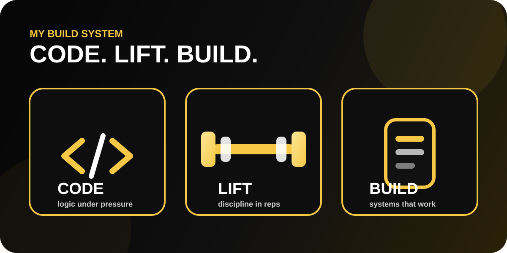
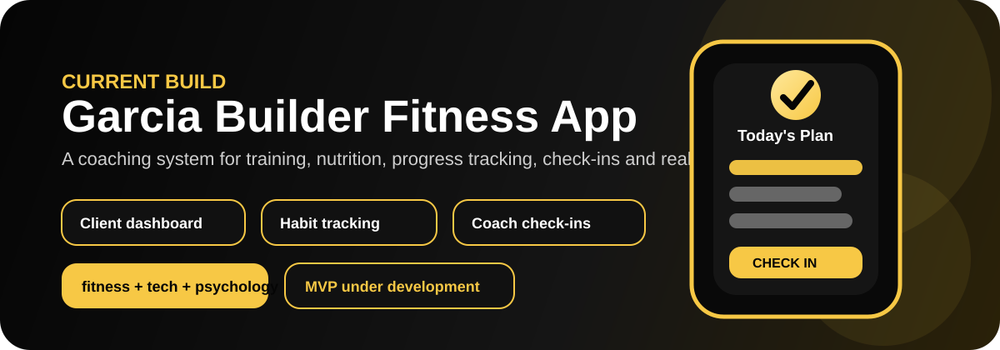

<p align="center">
  
</p>

<p align="center">
  
</p>

<p align="center">
  
  
  
</p>

<p align="center">
  <a href="mailto:andrenjulio072@gmail.com"></a>
  <a href="https://github.com/andrejulio072"></a>
  <a href="https://www.linkedin.com/in/andrejulio072/"></a>
  <a href="https://www.instagram.com/andrejulio072/"></a>
  <a href="https://wa.me/447597689690"></a>
</p>

<p align="center">
  
</p>

---

## 🧬 Complete Bio


I am **Andre Garcia**, a **Computer Science student at Maynooth University**, **Full-Stack Developer**, **online fitness coach**, **bodybuilder**, and **former Brazilian Air Force cadet** currently based in **Ireland 🇮🇪**.

My background is not a straight line. It is more like a Git history with war commits, failed builds, emergency patches, brutal refactors and a few commits that probably should have been squashed.

I grew up between **Brazil 🇧🇷 and Spain 🇪🇸**, served **5 years in the Brazilian Air Force**, rebuilt my life in **London**, worked through gyms, hospitality, security and management, completed a full-stack coding bootcamp, and now I am building a stronger technical foundation through **Computer Science at Maynooth University**.

The unusual part is exactly the point. I do not come to software only from tutorials and syntax. I come from pressure, discipline, leadership, bodybuilding, coaching, customer problems, real-life operations and the ability to keep moving when motivation disappears.

I see code the same way I see training: systems, structure, progressive overload, patience and execution. Bad code is like bad form. It might work today, but eventually something breaks.

```txt
Military mindset       → discipline under pressure
Bodybuilding           → consistency when motivation dies
Computer Science       → theory, logic, algorithms and systems
Full-stack development → building useful products from idea to deployment
Fitness coaching       → behaviour change, human psychology and accountability
Current mission        → merge technology, health and human performance
```

---

## 🎓 Computer Science at Maynooth University

<p align="center">
  
</p>

I am currently developing my academic foundation in **Computer Science / Computer Engineering at Maynooth University**. This is where I am strengthening the theory behind the execution: programming, algorithms, logic, systems thinking, mathematics and problem solving.

My goal is not only to become someone who can build apps. My goal is to understand how systems work deeply enough to build better, cleaner and more scalable solutions.

```txt
Current academic focus:
Java programming
Problem solving
Algorithms and logic
Computer systems
Mathematics for computing
Software engineering foundations
```

---

## 📱 Garcia Builder Fitness App

<p align="center">
  
</p>

I am currently developing the idea and structure for the **Garcia Builder Fitness App**, a project that connects my fitness coaching experience with my software development journey.

The goal is to build more than a basic workout tracker. I want to create a coaching platform that helps people follow training, nutrition and behaviour change with more clarity, accountability and structure.

### What I want the app to solve

Many fitness apps give people exercises and calories, but they do not always solve the real problem: lack of consistency, confusion, poor feedback, emotional eating, low accountability and not knowing what to adjust when progress stops.

Garcia Builder Fitness App is being designed around the coach-client relationship, not just around workouts.

### Planned features

| Area | Feature idea |
|---|---|
| Client onboarding | Goals, body data, lifestyle, training experience and barriers |
| Training | Personalised workouts, exercise notes, weekly progression and substitutions |
| Nutrition | Calorie targets, protein targets, simple meal guidance and adherence tracking |
| Check-ins | Weekly feedback, photos, measurements, weight trends and coach notes |
| Behaviour | Habits, discipline score, sleep, stress and consistency tracking |
| Coach dashboard | Client overview, red flags, progress status and communication flow |
| Education | Simple explanations so clients understand the process, not just follow orders |

```js
const garciaBuilderFitnessApp = {
  mission: "help clients rebuild their body, habits and confidence",
  focus: ["training", "nutrition", "check-ins", "behaviour", "accountability"],
  targetUser: "busy people who need structure, not motivational noise",
  status: "MVP concept and development planning",
  philosophy: "fitness progress is a system, not a random burst of motivation"
};
```

---

## 😂 Developer Gym Logic

> Some people chase PRs on GitHub.  
> I chase PRs in the gym too.  
> Pull Requests. Personal Records. Same pain, different repository.

I lift weights.  
I lift bugs.  
I lift state.  
I occasionally lift production errors and pretend it was part of the program.

```js
const andre = {
  role: "Computer Science Student + Full-Stack Developer",
  background: ["Brazilian Air Force", "Bodybuilding", "Gym Management", "Fitness Coaching"],
  dailySplit: ["train body", "train mind", "write code", "fight bugs"],
  weakness: "CSS acting like it pays rent",
  superpower: "turning pressure into output"
};

while (alive) {
  andre.dailySplit.forEach(task => execute(task));

  if (motivation === 0) {
    discipline++;
  }

  if (bug.level === "boss fight") {
    console.log("Time to progressive overload the brain.");
  }
}
```

---

## 🏋🏼‍♂️ Gym x Code Translation Table

| Gym Life | Developer Life |
|---|---|
| Warm-up sets | Reading the documentation before touching the code |
| Heavy squat | Debugging a bug that only happens in production |
| Ego lifting | `git push --force` without thinking |
| Cutting phase | Removing useless code and pretending it was easy |
| Bulking phase | Installing one package and receiving 478 dependencies |
| Deload week | Refactoring without adding new features |
| Bad form | Copy-pasting from Stack Overflow with zero understanding |
| Personal Record | Pull Request that actually gets approved |
| Leg day | Fixing CSS layout on mobile |
| Coach says “one more rep” | Senior dev says “just one small change” |
| DOM manipulation | Trying to move furniture in a tiny gym at peak time |
| Merge conflict | Two personal trainers trying to use the same squat rack |

---

## 📆 My Developer Training Split

```txt
Monday     Chest + React components
Tuesday    Legs + Java loops
Wednesday  Back + API routes
Thursday   Shoulders + Git conflicts
Friday     Arms + CSS that refuses to center
Saturday   Cardio + deployment anxiety
Sunday     Rest day... just kidding, README improvements
```

<p align="center">
  
</p>

---

## 🛠️ Tech Arsenal

### Languages & Frameworks
<p>
  
  
  
  
  
  
  
  
</p>

### Tools, Platforms & Workflow
<p>
  
  
  
  
  
  
  
</p>

---

## 🧩 Projects that Define Me

| Project | What it shows | Status |
|---|---|---|
| **Garcia Builder Fitness App** | Coaching platform concept joining fitness, software and behaviour change | 🧠 In development planning |
| [Garcia Builder](https://andrejulio072.github.io/Garcia-Builder/) | Fitness coaching brand, landing page, multilingual direction and behaviour-focused offer | ✅ Live |
| Stay Safe | Community safety concept built during my full-stack journey | ⚠️ Needs link refresh |
| Candles Store | Full-stack eCommerce practice project | ⚠️ Needs redeploy |
| Portfolio | My wider developer journey and case studies | 🔄 To update |

> I prefer to show real evolution instead of pretending every old project is perfect. Some projects were built while learning, some need rebuilding, and that is part of the process.

---

## 🧠 What I Bring to Software

```txt
I do not only bring code.
I bring discipline from the military.
I bring consistency from bodybuilding.
I bring communication from coaching.
I bring pressure management from gym operations.
I bring theory from Computer Science.
I bring execution from rebuilding my life more than once.
```

The goal is simple: build things that are useful, clean, practical and hard to ignore.

---

## 🏆 GitHub Trophy Cabinet

<p align="center">
  
</p>

---

## 📊 GitHub Training Log

<p align="center">
  
</p>

<p align="center">
  
  
</p>

<p align="center">
  
</p>

---

## 🧠 My Operating System

```txt
Input:  pressure, problems, heavy days
Process: logic, discipline, repetition
Output: stronger code, stronger body, stronger mind
```

I am not here only to write code.  
I am here to build systems, solve problems, keep learning, and turn pressure into output.

```bash
andre@github:~$ npm run life
> building body...
> building software...
> building discipline...
> warning: comfort zone not found
> success: stronger version deployed
```

---

## 🌍 Connect with Me

<p align="center">
  <a href="mailto:andrenjulio072@gmail.com"></a>
  <a href="https://www.linkedin.com/in/andrejulio072/"></a>
  <a href="https://github.com/andrejulio072"></a>
</p>

---

<p align="center">
  
</p>
